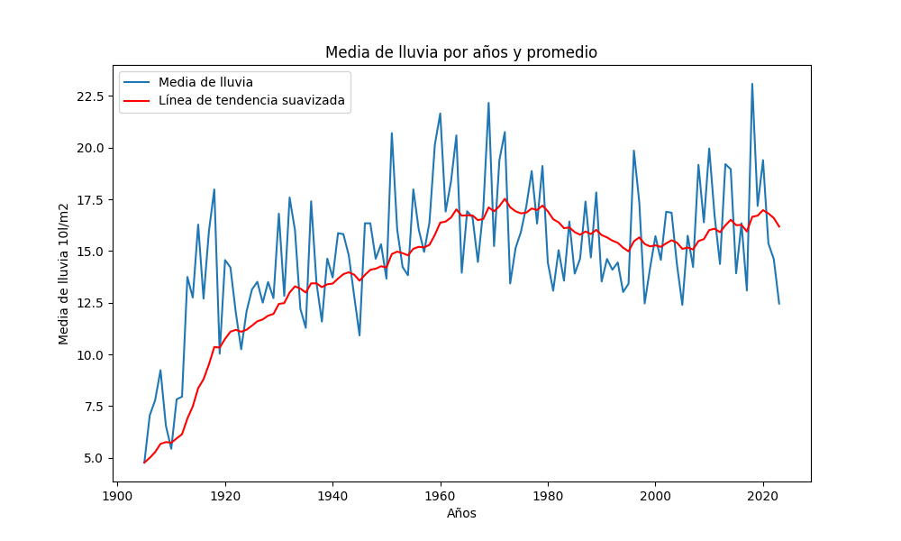
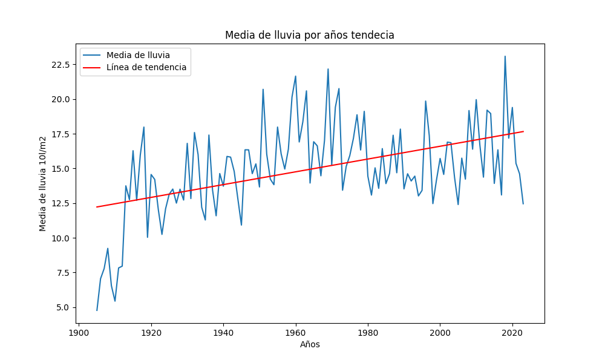
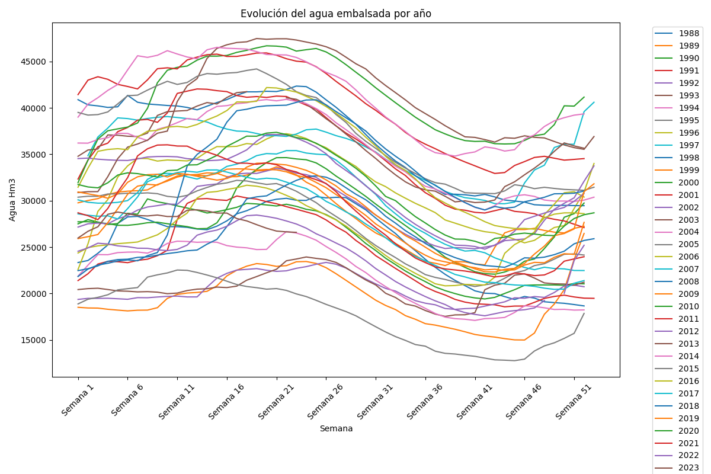

# Análisis Histórico del Clima: Tendencias y Variabilidad en España

## 1. Introducción
El clima desempeña un papel fundamental en nuestra sociedad, influyendo en una amplia gama de aspectos que afectan nuestra vida diaria. Desde la seguridad alimentaria y la planificación urbana hasta la gestión de recursos hídricos, comprender las tendencias y la variabilidad del clima es esencial para tomar decisiones informadas y desarrollar estrategias efectivas.

En este proyecto se enfoca en analizar el histórico del clima en España, un país con una diversidad geográfica notable. Para llevar a cabo este análisis, se ha recurrido a una combinación de datos recopilados de fuentes verificadas por, Ministerio para la Transición Ecológica, AEMET y SAIH : 
- [National Oceanic and Atmospheric Administration (NOAA)](https://www.noaa.gov/), 
- [Embalses.net](https://www.embalses.net/) y 
- [DatosClima.es](https://datosclima.es/index.htm), 

Se pretenden investigar las tendencias y la variabilidad climáticas claves, como la temperatura y las precipitaciones a lo largo del tiempo.

Para llevar a cabo este análisis, se han utilizado técnicas de procesamiento de datos y visualización para explorar y comprender los patrones climáticos en diferentes regiones de España. También se ha examinado la relación entre las variables climáticas y otros fenómenos, como la disponibilidad de agua en embalses y estaciones hidrológicas.

## 2. Objetivo
El objetivo central de este proyecto radica en la recolección y análisis de datos sobre las tendencias climáticas en España, su influencia en el entorno natural y las actividades humanas. Este conocimiento nos brindará una comprensión más profunda de los desafíos que enfrentamos en la gestión del agua, permitiendo al lector desarrollar una compresión más amplia de nuestro entorno.

Para realizar este análisis se han utilizado distintas visualizaciones generadas mediante la librería “matplotlib” del lenguaje de programación “Python” 

Se han utilizado datos de 207 estaciones meteorológicas españolas repartidas por cada provincia española, se buscarán patrones y tendencias en los distintos registros entre los años 1990 y 2020 con la finalizad de entender la evolución meteorológica sufrida en este periodo de tiempo. 

Una vez analizados los datos, podremos contestar a preguntas como las que se muestran a continuación: 
- ¿Cuál es la tendencia en la evolución de las temperaturas en los últimos años? 
- ¿Cuál es la tendencia en la evolución de las precipitaciones en los últimos años?  
- •	¿Qué grado de correlación hay entre las dos variables? 

## 3. Metodología
### 3.1 Conjunto de datos
Los conjuntos de datos recopilan información meteorológica relevante y están organizados por año. Para acceder a ellos, podemos utilizar el centro de descargas de la "National Oceanic and Atmospheric Administration (NOAA)", disponible en la sección de descargas. Además, la información histórica de los embalses se encuentra disponible en embalses.net, mientras que el resto de los datos pueden consultarse en DatosClima.es.

### 3.2 Herramientas
Para la realización de las tareas de preprocesado de los datos, realizar consultas, modificaciones y gestión de datos se ha utilizado el lenguaje de SQL en MySQL Workbench, todo descrito en un archivo Markdown alojado en la sección de código alojado en esta misma carpeta, para revisarlo simplemente pincha en el siguiente enlace [Códico](https://github.com/icarolosada/Analisis-de-Datos/blob/main/Codigo.md).

Para la visualización de gráficas se ha utilizado el lenguaje de programación Python el cual se ejecuta sobre un Notebook de Jupyter, utilizando la librería [Matplotlib](https://matplotlib.org/) se puede ver todo el código y gráficas en la carpeta de Visualizaciones accede pinchando en [visualizaciones](https://github.com/icarolosada/Analisis-de-Datos/tree/master/Visualizaciones/Visualizaciones)  

Jupyter Notebook es una herramienta poderosa y versátil que permite programar, ejecutar y compartir código de manera interactiva. Es un entorno de desarrollo basado en web que facilita la creación y edición de documentos en los que se pueden combinar código, visualizaciones, texto explicativo y otros elementos.

## 4. Tratamiento o preparación de los datos
Los procesos que describo a continuación se encontrarán comentados en un [Notebook de Jupyter ]([https://xxxxxx](https://jupyter.org/)) que también se podrán ejecutar desde este [Notebook2](https://github.com/icarolosada/Analisis-de-Datos/blob/master/Codigo/Codigo/Notebook2.ipynb) alojado este mismo post de Github en la carpeta de [Códico](https://github.com/icarolosada/Analisis-de-Datos/blob/main/Codigo.md). 

Antes de lanzarse a construir una visualización efectiva, debemos realizar un tratamiento previo de los datos, prestando especial atención a la obtención de los mismos y validando su contenido, asegurando que se encuentran en el formato adecuado y consistente para su procesamiento y que no contienen errores. Todo se ha realizado mediante consultas en MySQL descritas el archivo [SQL_Query](https://github.com/icarolosada/Analisis-de-Datos/blob/master/Codigo/Codigo/SQL_Query.md) 

Como primer paso del proceso, una vez que se han importado los datos necesarios en formato .csv y se han cargado en la base de datos, es crucial llevar a cabo un análisis exploratorio de los datos (EDA). Este análisis tiene como objetivo interpretar adecuadamente los datos de partida, identificar posibles anomalías, datos faltantes o errores que puedan afectar la calidad de los procesos y los resultados posteriores. Para obtener más detalles sobre el análisis realizado, se puede consultar el archivo [SQL_Query](https://github.com/icarolosada/Analisis-de-Datos/blob/master/Codigo/Codigo/SQL_Query.md)que describe dicho proceso.

El siguiente paso consiste en generar las tablas de datos preprocesados que utilizaremos para nuestras visualizaciones. Para lograr esto, filtraremos los conjuntos de datos iniciales y calcularemos los valores relevantes y necesarios para el análisis llevado a cabo en este ejercicio. Puedes encontrar más detalles sobre este proceso en el apartado [datos_procesados](https://github.com/icarolosada/Analisis-de-Datos/tree/master/Datos_procesados)

Una vez terminado el preprocesamiento, obtendremos las tablas de datos “media_lluvia_anos.xlsx” , “Media_temperaturas_anos.xlsx” y  "Capacida_embalses.xlsx" las cuales utilizaremos en el siguiente apartado del Notebook para generar las visualizaciones.  

La estructura del Notebook en la que se realizan los pasos previamente descritos junto a comentarios explicativos de cada uno de ellos, es la siguiente: 

1. Instalación y carga de librerías
2. Carga de los conjuntos de datos
3. Análisis exploratorio de datos (EDA)
4. Preparación de las tablas de datos
5. Visualizaciones
6. Guardado de gráficos

Se podrá reproducir este análisis, ya que el código fuente está disponible en esta misma rama de GitHub. La forma de proporcionar el código es a través de un documento realizado sobre un Jupyter Notebook que una vez cargado en el entorno de desarrollo podrás ejecutar o modificar de manera sencilla. EL carácter de este post es totalmente informativo y quiere favorecer el entendimiento de los lectores no especializados, el código no pretende ser el más eficiente, sino facilitar su comprensión por lo que posiblemente se te ocurrirán muchas formas de optimizar el código propuesto para lograr fines similares. ¡Te animo a que lo hagas! 

## 5. Visualizaciones
Se han creado diversas visualizaciones y gráficos utilizando la biblioteca de visualización de datos matplotlib en Python, con el objetivo de extraer información de las tablas de datos preprocesadas y responder a las preguntas iniciales planteadas en este ejercicio.

Matplotlib es una biblioteca de visualización ampliamente utilizada en el lenguaje de programación Python. Permite generar una amplia variedad de gráficos, como gráficos de líneas, de barras, de dispersión, de torta, entre otros. Con matplotlib, es posible personalizar cada aspecto de las visualizaciones, incluyendo los ejes, etiquetas, colores y estilos.

En la siguiente [carpeta](https://github.com/icarolosada/Analisis-de-Datos/tree/master/Visualizaciones/Visualizaciones), encontrarás todas las visualizaciones generadas utilizando matplotlib, que se describen en los siguientes apartados.

## 5.1 Gráficos
Los gráficos son representaciones visuales de datos que nos permiten comunicar información de manera efectiva. Hay una amplia variedad de tipos de gráficos disponibles, como gráficos de barras, gráficos de líneas, gráficos de dispersión y gráficos circulares, entre otros. Los gráficos de barras son útiles para comparar la magnitud de diferentes categorías y para visualizar diferencias entre ellas. 

# 6. Conclusiones del ejercicio

En el marco de este ejercicio de análisis de datos, nuestro objetivo radica en abordar una serie de incógnitas relacionadas con la evolución de las temperaturas, precipitaciones y otras variables registradas en varias estaciones climatológicas en España desde 1890. 

## Temperaturas 
##### datos obtenidos de (NOAA)

Comenzando por las temperaturas medias máximas, se ha observado un descenso, mientras que las temperaturas medias mínimas han experimentado un aumento. En relación a la temperatura media anual, se ha constatado un descenso notable desde principios de siglo, donde se registraba una media de 15.1°C. A mitad de siglo, se alcanzó la temperatura más baja registrada, con un valor de 12.2°C, seguido de un ligero aumento hasta los 15.3°C. Es relevante destacar que durante las décadas de los 40, 50 y 60 se ha observado una temperatura notablemente más baja. Aunque esto podría sugerir un patrón cíclico, es importante señalar que se requiere un análisis a largo plazo para respaldar esta teoría, lo cual está fuera del alcance de este ejercicio. 

## Pluviometría
##### datos obtenidos de (NOAA)

Continuando con el análisis de la pluviométrico, los datos revelan un aumento significativo en la cantidad de precipitaciones registradas. Específicamente, se observa un incremento notable desde 1900 hasta la década de los 60. Posteriormente, el gráfico muestra una estabilización, lo que sugiere que el promedio de precipitación en el territorio español se ha mantenido constante. Es importante destacar que esta diferencia se debe, en gran medida, al incremento en el número de estaciones meteorológicas desde principios de siglo hasta los años 60-70. Esto ha permitido una mejor y más extensa recolección de datos pluviométricos. 

## Embalses
##### Datos obtenidos de (AEMET y SAIH)

En España, existen un total de 372 embalses con una capacidad de almacenamiento de agua de 56.000 hectómetros cúbicos (hm³). La gráfica muestra la evolución del agua embalsada en comparación con la capacidad durante los últimos 14 años. El punto más alto de agua embalsada se alcanzó en abril de 2013, registrando 47.400 hectómetros cúbicos. A partir de ese momento, se observa un descenso en el nivel de agua embalsada.

 
Podemos observar que el año 1995 ha registrado una menor cantidad de agua embalsada. Es importante destacar que esta tendencia se repite en varios años, lo cual se atribuye, en parte, al carácter estacionario del clima en España. Los patrones climáticos estables y la variabilidad en la disponibilidad de precipitaciones pueden influir en los niveles de agua embalsada a lo largo de los años. Es fundamental considerar estas fluctuaciones al planificar la gestión hídrica.

